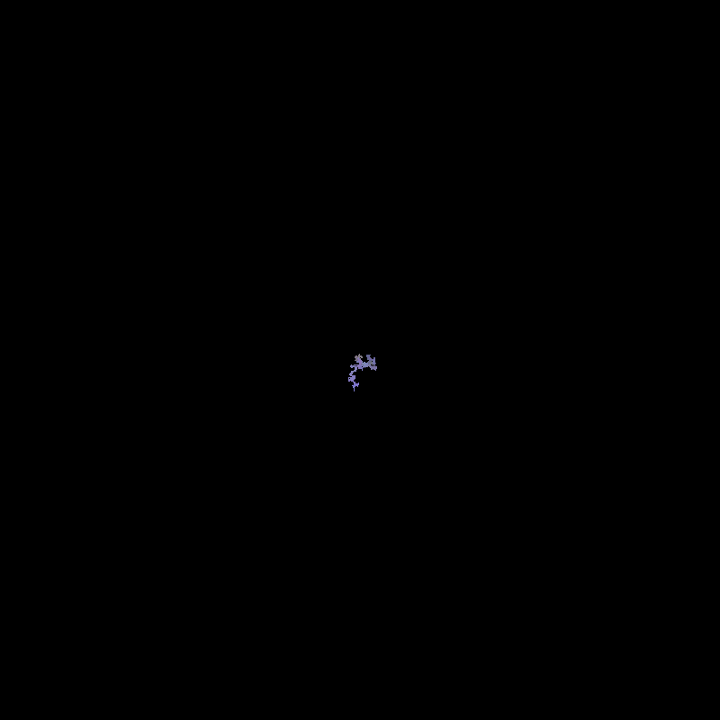
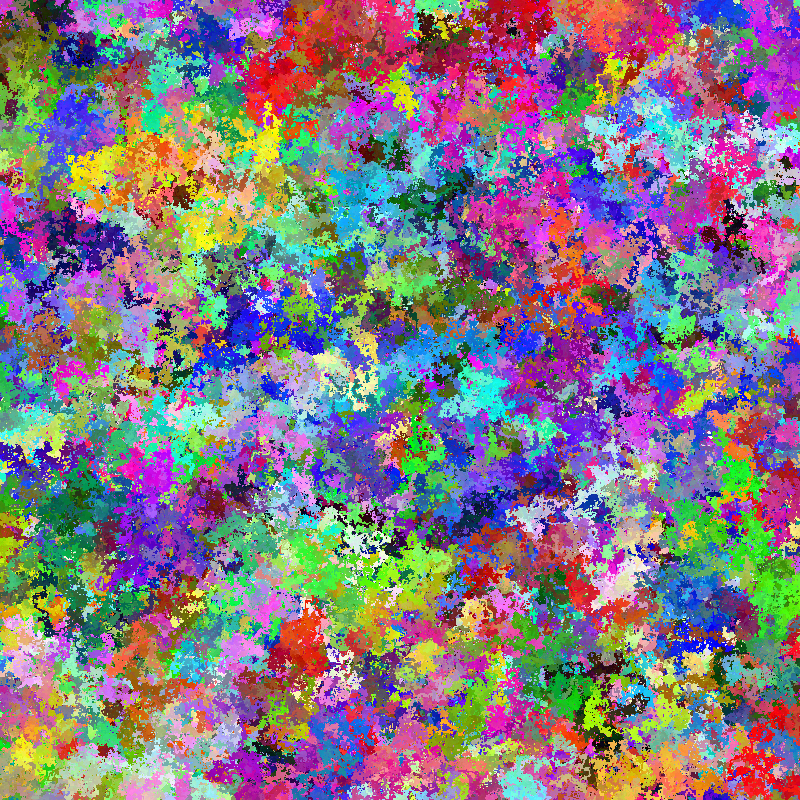

# Random Walk Art Generator

Wanted to experiment with random walks and creating "abstract art" with them (inspired by something I saw on twitter)

## Overview

This project generates unique abstract artwork by simulating a random walk across a canvas. As the algorithm moves randomly across the image, it continuously changes colors, creating organic, flowing patterns that (should) never repeat.

## Example Outputs

Here are some examples generated with this algorithm:

This is a random walk with 1000 steps


This is a random walk with 200 million steps


*Each image is unique and generated through millions of random steps*

## How It Works

The algorithm:
1. Starts from the center of the canvas
2. Randomly moves one pixel in any cardinal direction (up, down, left, right)
3. Adjusts the RGB color values slightly with each step
4. Paints the current pixel with the current color
5. Repeats for millions of steps, creating intricate patterns

## Features

- Configurable canvas dimensions
- Adjustable number of steps for different levels of detail
- Dynamic color evolution that stays within valid RGB ranges
- Progress tracking for long-running generations
- Pure Python implementation using NumPy and PIL

## Requirements

```bash
pip install numpy pillow
```

## Usage

Run the script to generate a random walk image:

```python
python random_walk_image.py
```

### Custom Parameters

You can customize the generation by modifying the parameters:

```python
canvas = generate_random_walk_image(
    width=800,          # Canvas width in pixels
    height=800,         # Canvas height in pixels
    num_steps=1000000000  # Number of steps (default: 1 billion)
)
```

## Algorithm Details

- **Movement**: 50/50 probability of moving horizontally or vertically
- **Color Change**: Each RGB channel randomly increases or decreases by 1 per step
- **Boundary Handling**: Position values are clamped to stay within canvas bounds

## Performance

The algorithm displays progress every 100,000 steps. Generation time depends on:
- Number of steps (more steps = more detail but longer runtime)
- Canvas size
- System performance

For reference, 1 billion steps typically takes several hours to complete on my machine (Nvidia 1060 Ti :cry:)

## Contributing

Feel free to fork, modify, and experiment with different algorithms or color evolution schemes!
